<div align="center">


<br/>

[](https://adult-ml-96zvzkoyrnd9qcfwblzexw.streamlit.app/)
[](#)
[](#-license)

<br/>


</div>

<br/>

## 📌 Overview

**Adult Income Prediction** is a binary classification pipeline that predicts whether a person's annual income is above or below **$50,000**, based on demographic and employment attributes from the classic **UCI Adult / Census Income dataset**.

The pipeline is built to be **deployment-ready end-to-end**: every preprocessing step — imputation, encoding, scaling — is fitted strictly on the training split and persisted with `joblib`, so the exact same transformations can be replayed on a single new row of raw input at inference time through the live Streamlit app above.

<div align="center">

</div>

---

## 👥 Authors

<table align="center">
<tr>
<td align="center">
<b>Eng. Kerolos Fady</b><br/>
<a href="https://github.com/kerolos722"></a>
</td>
<td align="center">
<b>Eng. Saif Ahmed</b><br/>
<a href="https://github.com/saifalaswad43"></a>
</td>
</tr>
</table>

---

## 📊 Dataset

<div align="center">

| 📈 | Metric |
|:--:|:--|
| **32,561** | Rows in the dataset |
| **14** | Predictive features (after dropping `fnlwgt`) |
| **income** | Target — `<=50K` or `>50K` |
| **12** | Classification models compared |

</div>

<details>
<summary><b>📖 Click to expand full Data Dictionary</b></summary>
<br/>

| Column | Description |
|---|---|
| `age` | Age of the individual |
| `workclass` | Employer type (Private, Government, Self-employed, …) |
| `education.num` | Education level, encoded ordinally |
| `marital.status` | Married / not married |
| `occupation` | Job category |
| `relationship` | Household relationship role |
| `race`, `sex` | Demographic attributes |
| `capital.gain` / `capital.loss` | Investment gains/losses (combined into `capital_diff`) |
| `hours.per.week` | Hours worked per week |
| `native.country` | United-States / Others |
| `income` | **Target** — `<=50K` or `>50K` |

</details>

---

## 🧠 Pipeline

```mermaid
flowchart LR
    A[📂 Raw Census Data] --> B[🧹 Cleaning & Category Consolidation]
    B --> C[📊 Exploratory Data Analysis]
    C --> D[⚙️ Feature Engineering<br/>capital_diff]
    D --> E[✂️ Train/Test Split<br/>80/20 stratified]
    E --> F[🔧 Preprocessing<br/>Impute · Encode · Scale]
    F --> G[🎯 Feature Selection<br/>Mutual Information]
    G --> H[🤖 Train & Compare<br/>12 Classifiers]
    H --> I[🏆 Tune Top 3 + Stacking]
    I --> J[💾 Save Deployment Artifacts]
    J --> K[🌐 Streamlit App]
```



---

## 🏆 Model Results

12 classifiers were trained with class-weighting to counter the ~76/24 income imbalance, then ranked by **Test F1 Score** — the right metric here since accuracy alone hides how well a model catches the minority `>50K` class.

<div align="center">

| Model | Test Accuracy | Test Precision | Test Recall | Test F1 | Balanced Acc. |
|---|:--:|:--:|:--:|:--:|:--:|
| 🥇 **CatBoost** | 0.833 | 0.608 | 0.867 | **0.715** | 0.845 |
| 🥈 XGBoost | 0.835 | 0.611 | 0.859 | 0.714 | 0.843 |
| 🥉 LightGBM | 0.831 | 0.604 | 0.871 | 0.713 | 0.845 |
| Hist Gradient Boosting | 0.829 | 0.602 | 0.863 | 0.709 | 0.841 |
| Gradient Boosting | 0.862 | 0.757 | 0.626 | 0.686 | 0.781 |
| AdaBoost | 0.850 | 0.722 | 0.610 | 0.662 | 0.768 |

</div>

> **Winner: CatBoost** — Test F1 = `0.715`, Balanced Accuracy = `0.845`, ROC-AUC = `0.926`. XGBoost and LightGBM followed closely behind, with the boosting family leading on recall for the `>50K` class.

**Top predictors** (by Mutual Information): `capital_diff` → `marital.status` → `age` / `education.num` → `occupation` / `hours.per.week`.

---

## 🛠️ Tech Stack

<div align="center">

&nbsp;
&nbsp;
&nbsp;
&nbsp;
&nbsp;
&nbsp;
&nbsp;


</div>

---

## 🚀 Deployment

Every fitted preprocessing object — categorical imputer, label maps, one-hot encoder, target encoder, scaler — plus the final trained model and the selected-feature list are saved with `joblib` immediately after fitting.

A final end-to-end simulation replays all of them, in order, on one truly raw census row and confirms the prediction matches the full pipeline exactly — the same path the **live Streamlit app** uses to turn a filled-in form into a prediction.

<div align="center">

### 🌐 [Try the Live App →](https://adult-ml-96zvzkoyrnd9qcfwblzexw.streamlit.app/)

</div>

---

## 📂 Project Structure

```
Adult-ML/
├── app.py                          # Streamlit application
├── Adult.ipynb                     # EDA, training & experimentation notebook
├── adult.csv                       # UCI Adult Census dataset
├── best_model.pkl                  # Trained CatBoost model
├── categorical_imputer.pkl         # Missing-value imputer
├── onehot_encoder.pkl              # One-hot encoder
├── occupation_target_encoder.pkl   # Target encoder (occupation)
├── marital_status_encoder.pkl      # Marital status map
├── native_country_encoder.pkl      # Native country map
├── sex_encoder.pkl                 # Sex map
├── standard_scaler.pkl             # Feature scaler
├── selected_features.pkl           # Final feature set
├── feature_columns_config.pkl      # Column configuration
└── requirements.txt                # Dependencies
```

---

## 🤝 Contributing

Contributions, issues, and feature requests are welcome!

1. Fork the project
2. Create your feature branch (`git checkout -b feature/amazing-feature`)
3. Commit your changes (`git commit -m 'Add amazing feature'`)
4. Push to the branch (`git push origin feature/amazing-feature`)
5. Open a Pull Request

---

## 📄 License

This project is licensed under the **MIT License**.

<div align="center">

### ⭐ If you found this project useful, consider giving it a star!


</div>
