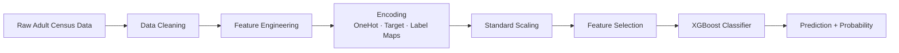

<div align="center">


<a href="https://github.com/saifalaswad43/Adult-ML">
  
</a>

<br/>


<br/><br/>


</div>

<br/>

## 📌 Overview

**Income Predictor Pro** is a machine learning web app that predicts whether a person's annual income exceeds **$50K**, based on demographic and employment attributes from the classic **UCI Adult Census Income Dataset**. It ships with a full **Streamlit** interface — form-based prediction, live probability gauges, historical tracking, and interactive analytics — backed by a tuned **XGBoost** classifier.

<div align="center">

</div>

---

## ✨ Features

<table>
<tr>
<td width="50%" valign="top">

### 🏠 Home — Prediction
- Full personal & financial input form
- Real-time inference with confidence score
- Animated result cards (high / low income)
- Quick contributing-factor breakdown

</td>
<td width="50%" valign="top">

### 📊 Analysis
- Live probability gauge (Plotly)
- Feature contribution bars
- Comparison vs. census averages
- Occupation income-tier grouping

</td>
</tr>
<tr>
<td width="50%" valign="top">

### 📜 History
- Session-based prediction log
- Filter / sort by confidence, date, age
- Trend charts & prediction distribution
- One-click CSV export

</td>
<td width="50%" valign="top">

### ℹ️ About
- Dataset & model documentation
- Performance metrics at a glance
- Tech stack badges
- FAQ section

</td>
</tr>
</table>

---

## 🧠 Model Pipeline



**Engineered features:** `capital_diff`, `capital_ratio`, `total_capital`, `education_hours`, `age_education`

| Metric | Score |
|:--|:--:|
| 🎯 Accuracy | **~87%** |
| 🎯 Precision | **~85%** |
| 🎯 Recall | **~82%** |
| 🎯 F1-Score | **~83%** |

---

## 🚀 Getting Started

### 1️⃣ Clone the repository
```bash
git clone https://github.com/saifalaswad43/Adult-ML.git
cd Adult-ML
```

### 2️⃣ Install dependencies
```bash
pip install -r requirements.txt
```

### 3️⃣ Run the app
```bash
streamlit run app.py
```

The app will open automatically at `http://localhost:8501` 🎉

---

## 📂 Project Structure

```
Adult-ML/
├── app.py                          # Streamlit application
├── Adult.ipynb                     # EDA, training & experimentation notebook
├── adult.csv                       # UCI Adult Census dataset
├── best_model.pkl                  # Trained XGBoost model
├── categorical_imputer.pkl         # Missing-value imputer
├── onehot_encoder.pkl              # One-hot encoder
├── occupation_target_encoder.pkl   # Target encoder (occupation)
├── marital_status_encoder.pkl      # Marital status map
├── native_country_encoder.pkl      # Native country map
├── sex_encoder.pkl                 # Sex map
├── standard_scaler.pkl             # Feature scaler
├── selected_features.pkl           # Final feature set
├── feature_columns_config.pkl      # Column configuration
└── requirements.txt                # Dependencies
```

---

## 🛠️ Tech Stack

<div align="center">


</div>

---

## 📊 Dataset

**Source:** [UCI Machine Learning Repository — Adult Census Income](https://archive.ics.uci.edu/dataset/2/adult)
**Size:** 48,842 records · 14 attributes
**Target:** Binary classification — income `>50K` or `<=50K`

---

## 🤝 Contributing

Contributions, issues, and feature requests are welcome!

1. Fork the project
2. Create your feature branch (`git checkout -b feature/amazing-feature`)
3. Commit your changes (`git commit -m 'Add amazing feature'`)
4. Push to the branch (`git push origin feature/amazing-feature`)
5. Open a Pull Request

---

## 📄 License

This project is licensed under the **MIT License**.

---

<div align="center">

### ⭐ If you found this project useful, consider giving it a star!


</div>
